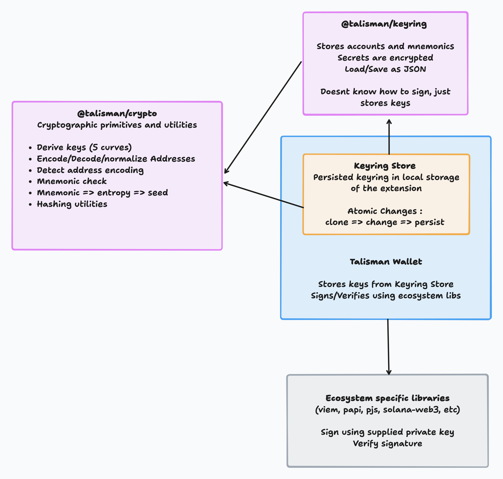

# @talismn/keyring

**@talismn/keyring** is a basic keyring implementation used by the Talisman wallet.

This keyring is not ecosystem specific. As such, it does not provide any signing functionality, and is only used to store accounts and mnemonics.

> ⚠️ This package relies on the browser's native crypto API for encryption and decryption. It is designed for use in modern browsers—Talisman wallet runs on Chromium v102+ and Firefox v109+ at the time of writing.
> Using this library in environments with weaker crypto API implementations, particularly for random number generation, may introduce security risks.
